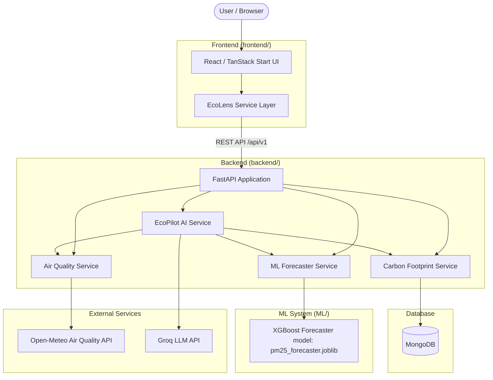

# EcoLens — Environmental Intelligence & PM2.5 Forecasting Platform

EcoLens is an integrated environmental intelligence platform that combines real-time air quality monitoring, physical machine learning PM2.5 forecasting (6-hour horizon), deterministic personal carbon footprint tracking, and an AI assistant (EcoPilot powered by Groq LLM).

---

## 1. Overview & Architecture

### Repository Root Structure

```
EcoLens/
├── backend/       # Unified FastAPI service & MongoDB database layer
├── frontend/      # TanStack Start / React web interface
├── ML/            # Physical XGBoost PM2.5 Forecasting pipeline & model artifacts
└── README.md      # Root system documentation
```

### System Architecture Diagram



---

## 2. Key Features

1. **Local Air Quality & EPA AQI Monitoring**
   - Retrieves location-specific pollutant concentrations (`PM2.5`, `PM10`, `NO₂`, `O₃`, `SO₂`, `CO`) via Open-Meteo API.
   - Derives standard EPA Air Quality Index (AQI) and category ratings.

2. **6-Hour PM2.5 Machine Learning Forecasting**
   - Powered by a physical XGBoost Regressor model trained on 10 years of hourly observations (87,672 rows).
   - Predicts ambient $\text{PM2.5}(t + 6 \text{ hours})$ using lag and rolling statistics without data leakage.

3. **Personal Carbon Footprint Tracking**
   - Deterministic emission calculations using documented emission factors across Transport, Electricity, Food, Travel, and Custom activities.
   - Activity log persistence in MongoDB.

4. **EcoPilot AI Assistant**
   - Powered by Groq LLM (`llama-3.3-70b-versatile`).
   - Context-aware answers drawing from real backend environmental measurements, ML forecast outputs, and user footprint records with strict anti-hallucination data safety rules.

---

## 3. Machine Learning (ML) Details

- **Model**: XGBoost Regressor (`ML/models/pm25_forecaster.joblib`)
- **Dataset**: `THULab/air-quality` (10 years hourly data: 2015-2024, 87,672 records)
- **Target**: $\text{PM2.5}(t + 6\text{h})$ in µg/m³
- **Features (29 total)**:
  - Temporal: `hour`, `day_of_week`, `day_of_month`, `month`, `day_of_year`, `is_weekend`, `hour_sin`, `hour_cos`, `month_sin`, `month_cos`
  - Lags: `pm25_lag_1h`, `pm25_lag_3h`, `pm25_lag_6h`, `pm25_lag_12h`, `pm25_lag_24h`
  - Rolling Means: `pm25_roll_mean_3h`, `pm25_roll_mean_6h`, `pm25_roll_mean_12h`, `pm25_roll_mean_24h`
  - Multi-variable: `pm10`, `no2`, `co`, `so2`, `o3`, `temp`, `rh`, `wind`, `rain`
- **Actual Evaluation Metrics (Test Set)**:
  - **MAE**: $17.35$ µg/m³
  - **RMSE**: $28.44$ µg/m³
  - **$R^2$**: $0.5456$
  - **MAPE**: $49.05\%$

---

## 4. Backend API Reference

Base Path: `/api/v1`

| Endpoint | Method | Description |
| :--- | :---: | :--- |
| `/health` | `GET` | Service health status |
| `/api/v1/air/current` | `GET` | Real-time air quality & computed EPA AQI for location |
| `/api/v1/air/history` | `GET` | 15-point historical PM2.5 readings |
| `/api/v1/air/forecast` | `GET` | 6-hour PM2.5 forecast from XGBoost ML model |
| `/api/v1/footprint` | `GET` | User carbon footprint summary & category breakdown |
| `/api/v1/footprint/activity` | `POST` | Log activity & record computed CO2e in MongoDB |
| `/api/v1/footprint/trend` | `GET` | Monthly carbon footprint trend |
| `/api/v1/ecopilot/chat` | `POST` | Query EcoPilot AI (Groq integration) |
| `/api/v1/alerts` | `GET` | Environmental alerts & notifications |

---

## 5. Environment Variables (`.env.example`)

```env
MONGODB_URI=mongodb://localhost:27017
GROQ_API_KEY=your_groq_api_key_here
AIR_QUALITY_API_KEY=
ML_MODEL_PATH=ML/models/pm25_forecaster.joblib
CORS_ORIGINS=["*"]
```

---

## 6. Local Setup & Execution Guide

### Prerequisites
- Python 3.12+
- Node.js 18+ and npm
- MongoDB (optional, fallback in-memory supported)

### Step 1: Clone and Environment Setup
```bash
python3 -m venv venv
source venv/bin/activate
pip install -r backend/requirements.txt
```

### Step 2: Start Backend Server
```bash
uvicorn backend.app.main:app --reload --port 8000
```

### Step 3: Start Frontend Client
```bash
cd frontend
npm install
npm run dev
```

---

## 7. Running Tests

- **Backend API Tests**:
  ```bash
  source venv/bin/activate
  python -m unittest backend/tests/test_api.py
  ```

- **ML Pipeline Tests**:
  ```bash
  source venv/bin/activate
  cd ML && PYTHONPATH=. pytest
  ```

- **Frontend Production Build**:
  ```bash
  cd frontend && npm run build
  ```

---

## 8. Architectural Decisions & Limitations

- **Physical ML Directory Separation**: `ML/` remains a physical top-level directory sibling to `backend/` and `frontend/` to maintain clean pipeline isolation.
- **Single Backend**: A single FastAPI service acts as the unified gateway for all application capabilities.
- **Measured Data vs. Prediction Distinction**: Measurements represent ground-truth observations, whereas 6-hour PM2.5 forecast values are ML statistical predictions and are explicitly flagged as such.
- **Groq AI Safety**: System prompts strictly constrain EcoPilot to use provided environmental context and prevent hallucinations regarding missing sensor metrics.
